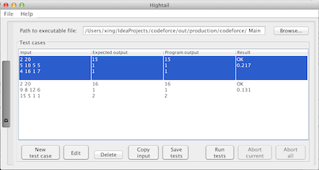

# Codeforce totuorial
A brief tutorial can be found from the [blog](https://algocoding.wordpress.com/2013/03/09/codeforces-tutorial-1-introduction/). Compared to Leetcode, Codeforces is more difficult and the website takes a little time to get familiar with, the above website provide a simple start tutorial. 

### Useful plug-in

 [CHelper for IntelliJ IDEA](http://codeforces.com/blog/entry/3273) Fast lauch and type the code. moj plugin  for TOPCODER.
 
 [high tail](http://codeforces.com/blog/entry/13141) automatic tester for programming contests. Java configuration is a little confuse, please check the tool. 
 
 
 
### Java input and output
The Codeforces require coders to write their own function to read the inputs. Here is an overview using the `Scanner` class (see also the [documentation](http://docs.oracle.com/javase/7/docs/api/java/util/Scanner.html)). One usage example in real contest can be found [xenoslash, 279B](http://codeforces.com/contest/279/submission/3242856).

```
import java.io.*;
import java.util.*;
  
public class Main{
   public static void main(String[] args) {
      MyScanner sc = new MyScanner();
      out = new PrintWriter(new BufferedOutputStream(System.out));
     
      // Start writing your solution here. -------------------------------------  
      /*
      int n      = sc.nextInt();        // read input as integer
      long k     = sc.nextLong();       // read input as long
      double d   = sc.nextDouble();     // read input as double
      String str = sc.next();           // read input as String
      String s   = sc.nextLine();       // read whole line as String
 
      int result = 3*n;
      out.println(result);                    // print via PrintWriter
      */
      // Stop writing your solution here. -------------------------------------
      out.close();
   }
 
      
 
   //-----------PrintWriter for faster output---------------------------------
   public static PrintWriter out;
       
   //-----------MyScanner class for faster input----------
   public static class MyScanner {
      BufferedReader br;
      StringTokenizer st;
  
      public MyScanner() {
         br = new BufferedReader(new InputStreamReader(System.in));
      }
  
      String next() {
          while (st == null || !st.hasMoreElements()) {
              try {
                  st = new StringTokenizer(br.readLine());
              } catch (IOException e) {
                  e.printStackTrace();
              }
          }
          return st.nextToken();
      }
  
      int nextInt() {
          return Integer.parseInt(next());
      }
  
      long nextLong() {
          return Long.parseLong(next());
      }
  
      double nextDouble() {
          return Double.parseDouble(next());
      }
  
      String nextLine(){
          String str = "";
	      try {
	         str = br.readLine();
	      } catch (IOException e) {
	         e.printStackTrace();
	      }
	      return str;
      }
   }
   //--------------------------------------------------------
}
```